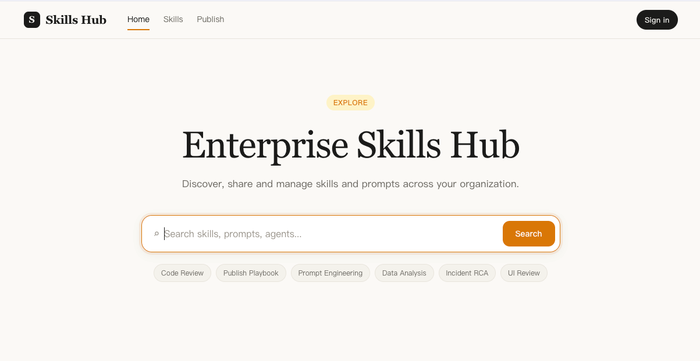

# Skills Hub

<p align="center">
  
</p>

Skills Hub is an artifact platform for **skills**, **prompts**, and **agents**.
This repository is a pnpm monorepo that includes a registry server, a CLI, a web UI, and an admin UI.

## Visual Preview




> [!NOTE]
> Current artifact schema uses `kind: skills | prompt | agent` and `author_name`.

## What You Can Do

- Publish artifacts to a local or remote registry
- Search, list, install, and sync artifacts from CLI
- Browse and publish from web UI
- Manage approvals, users, and settings from admin UI
- Persist metadata in SQLite and payloads on local filesystem

## Monorepo Structure

```text
apps/
  cli/      CLI entrypoint and commands
  server/   Fastify API server
  web/      User-facing React app (Vite)
  admin/    Admin React app (Vite)

packages/
  core/            Domain types, validators, factories
  storage/         SQLite + file storage adapters
  services/        Publish/search/install/sync/login services
  registry-client/ HTTP client for registry APIs
  config/          Config loading and defaults
  loader/          Artifact loader and packaging
  handlers/        Builtin artifact handlers
  utils/           Logger/fs/hash helpers
```

## Requirements

- Node.js 18+
- pnpm 9+

## Quick Start

```bash
pnpm install

# start server (non-watch)
pnpm server

# start web
pnpm web

# start admin
pnpm admin
```

For full workspace development:

```bash
pnpm dev
```

Build all packages and apps:

```bash
pnpm build
```

## Runtime Data and Config

Default data directory:

- `~/.skillos`

Key files:

- `~/.skillos/config.json`
- `~/.skillos/db.sqlite`
- `~/.skillos/artifacts/`

Override data directory with environment variable:

```bash
export SKILLOS_HOME=/custom/path
```

## Core Artifact Manifest

```json
{
  "kind": "skills",
  "name": "team/code-review",
  "version": "1.0.0",
  "description": "Reviews TypeScript pull requests",
  "tags": ["code", "review", "typescript"],
  "author_name": "Platform Team",
  "license": "Apache-2.0",
  "entry": "SKILL.md",
  "metadata": {
    "runtime": "any"
  }
}
```

Valid `kind` values:

- `skills`
- `prompt`
- `agent`

## CLI Usage

Run via root script:

```bash
pnpm cli --help
```

Common commands:

```bash
# login and save token to default registry config
pnpm cli login

# publish from source directory (auto detect + pack)
pnpm cli publish --source ./my-skill

# publish in legacy mode (manifest + payload)
pnpm cli publish --manifest ./manifest.json --payload ./artifact.tgz

# list local artifacts
pnpm cli list --limit 50

# install by full id
pnpm cli install skills:team/code-review@1.0.0

# install by name (default kind is skills)
pnpm cli install team/code-review --kind skills

# sync from configured remote registry
pnpm cli sync
```

## HTTP API

Base URL defaults to `http://127.0.0.1:7421`.

### Public APIs

- `GET /healthz`
- `GET /api/artifacts?kind=&q=&limit=&offset=`
- `GET /api/artifacts?username=&limit=`
- `GET /api/artifacts/:id`
- `GET /api/artifacts/:id/download`
- `GET /api/artifacts/:kind/:name/versions`
- `POST /api/artifacts` (multipart: `manifest` + `payload`)
- `POST /api/auth/login`

### Admin APIs (JWT admin)

- `GET /api/admin/dashboard`
- `GET /api/admin/artifacts`
- `PATCH /api/admin/artifacts/:id/approval`
- `GET /api/admin/users`
- `POST /api/admin/users`
- `PATCH /api/admin/users/:id/disable`
- `POST /api/admin/users/:id/reset-password`
- `GET /api/admin/settings`
- `PUT /api/admin/settings`
- `POST /api/admin/settings/logo`

## Architecture Notes

- `packages/core` is the type and validation boundary.
- `packages/storage` owns all persistence and repository queries.
- `packages/services` orchestrates use cases and keeps apps thin.
- `apps/server` wires routes and dependencies.
- `apps/cli`, `apps/web`, and `apps/admin` consume the service and API layers.

## Security and Dev Defaults

> [!WARNING]
> If `SKILLOS_JWT_SECRET` is not set, server uses a development secret.
> Set this env var in production environments.
